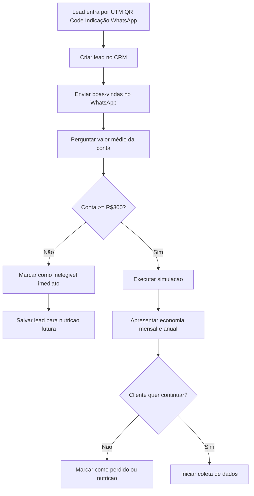

# Jornada: Captação e Qualificação de Leads — Energia Solar

Fluxo automatizado de captação via WhatsApp (UTM / QR Code / Indicação) com qualificação por valor de conta de energia, simulação de economia e roteamento.



---

## Arquitetura da Solução

Este fluxo combina duas camadas:

- **Agente de IA** — conduz a conversa via WhatsApp (perguntas, cálculo, registro de atributos)
- **Jornada (Evo Flow)** — orquestra os nós de espera, condicionais e roteamento pós-qualificação

---

## Pré-requisitos

### Atributos customizados de contato

**`Configurações → Atributos → Contato → Adicionar Atributo`**

| Chave | Nome de exibição | Tipo |
|---|---|---|
| `valor_conta` | Valor Médio da Conta | Número |
| `economia_mensal` | Economia Mensal (R$) | Número |
| `economia_anual` | Economia Anual (R$) | Número |
| `qualificacao_energia` | Status de Qualificação | Lista: `qualificado`, `inelegivel`, `perdido`, `nutricao`, `em_coleta` |

### Labels

**`Configurações → Labels → Nova Label`**

| Nome | Cor |
|---|---|
| `captacao-ativa` | Azul |
| `inelegivel` | Cinza |
| `qualificado-energia` | Verde |
| `perdido-energia` | Vermelho |
| `em-coleta-dados` | Roxo |

---

## Agente de IA — Qualificador de Conta

**`Agentes de IA → Novo Agente`**

| Campo | Valor |
|---|---|
| Nome | `Qualificador de Conta de Energia` |
| Modelo | `gemini-2.0-flash` |
| Temperatura | `0.2` |

**Ferramentas habilitadas:** `update_contact_attributes`, `add_label`, `get_contact_info`, `via_cep` (consulta ViaCEP)

**Instrução → Configurações → Canais → [canal] → Configuração de Agente de IA:** vincule este agente ao canal WhatsApp após criá-lo.

### System Prompt (versão simplificada — legado)

> ⚠️ Este prompt foi substituído pela versão completa em [cleve-agente1-qualificacao.md](cleve-agente1-qualificacao.md).
> A versão abaixo é mantida apenas para referência histórica.

```
Você é um assistente de qualificação de energia solar.
...
```

---

## Jornada — Captação Energia: Qualificação

**`Menu lateral → Automações → (aba Jornadas) → Nova Jornada`**

Nome: `Captação Energia — Qualificação`

### Nó 1 — Trigger

**Tipo:** `Contato Criado`

Sem filtros para capturar qualquer lead novo. Para rastrear origem específica (UTM, QR Code), use tipo `Evento` e filtre por `event.properties.source`.

**Mapeamento de variável (opcional):**
- `contact.identifier` → variável `origem_lead`

---

### Nó 2 — Add Label: controle de fluxo

**Tipo:** `Add Label`
- Label: `captacao-ativa`

---

### Nó 3 — Wait: aguardar qualificação do agente

**Tipo:** `Wait` → modo **Aguardar Condição**

| Opção | Valor |
|---|---|
| Campo | `contact attribute → qualificacao_energia` |
| Operador | `is_not_empty` |
| Timeout | `30 minutos` |
| Ao expirar | → Nó 5c (Nurturing por inatividade) |

> O agente de IA conduz a conversa e preenche `qualificacao_energia`. A jornada fica pausada aqui até o agente terminar.

---

### Nó 4 — Conditional: resultado da qualificação

**Tipo:** `Conditional`

| Caminho | Cor | Condição |
|---|---|---|
| Inelegível | Cinza | `custom.qualificacao_energia` equals `inelegivel` |
| Qualificado — quer continuar | Verde | `custom.qualificacao_energia` equals `em_coleta` |
| Qualificado — recusou | Laranja | `custom.qualificacao_energia` equals `nutricao` |
| Caso contrário | — | → Nó 5c (Nurturing) |

---

### Nó 5a — Saída: Inelegível

Após caminho **Inelegível**:

1. `Remove Label` → `captacao-ativa`
2. `Update Custom Attribute` → `qualificacao_energia` = `inelegivel`
3. `Exit Journey`

---

### Nó 5b — Saída: Qualificado — Iniciar Coleta

Após caminho **Qualificado — quer continuar**:

1. `Remove Label` → `captacao-ativa`
2. `Add Label` → `em-coleta-dados`
3. `Assign Team` → `Comercial` (time responsável pela proposta)
4. `Exit Journey`

> O agente de IA (ainda ativo no canal) prossegue com a coleta de dados iniciada na Etapa 3 do system prompt.

---

### Nó 5c — Saída: Nurturing / Inatividade

Após caminho **Qualificado — recusou**, timeout ou caso contrário:

1. `Remove Label` → `captacao-ativa`
2. `Add Label` → `perdido-energia`
3. `Update Custom Attribute` → `qualificacao_energia` = `nutricao`
4. `Snooze Conversation`
5. `Exit Journey`

---

## Visão do fluxo no editor

```
[Trigger: Contato Criado]
        │
[Add Label: captacao-ativa]
        │
[Wait: qualificacao_energia preenchido | timeout 30min]
        │
        ├─ timeout ─────────────────────► [Remove label] → [Add perdido-energia] → [Snooze] → [Exit]
        │
[Conditional]
   ├─ inelegivel ──────────────────────► [Remove label] → [Exit]
   ├─ em_coleta ───────────────────────► [Add em-coleta-dados] → [Assign Team Comercial] → [Exit]
   ├─ nutricao ────────────────────────► [Remove label] → [Add perdido-energia] → [Snooze] → [Exit]
   └─ caso contrário ──────────────────► [Remove label] → [Add perdido-energia] → [Snooze] → [Exit]
```

---

## Mapeamento: fluxograma → sistema

| Passo do fluxograma | Onde fica |
|---|---|
| Lead entra (UTM / QR / WA) | Trigger `contactCreated` na Jornada |
| Criar lead no CRM | Automático ao receber mensagem no WhatsApp |
| Enviar boas-vindas + perguntar valor | **Agente de IA** — Etapa 1 do system prompt |
| Conta >= R$300? | **Agente de IA** — calcula e salva `qualificacao_energia` |
| Marcar inelegível | **Agente** adiciona label + atributo; **Jornada** encerra |
| Executar simulação + apresentar economia | **Agente de IA** — Etapa 2 do prompt |
| Cliente quer continuar? | **Agente de IA** — capta resposta na Etapa 3 |
| Iniciar coleta de dados | **Agente** muda label para `em-coleta-dados`; **Jornada** atribui time |
| Marcar perdido / nurturing | **Agente** + **Jornada** via condicional |
